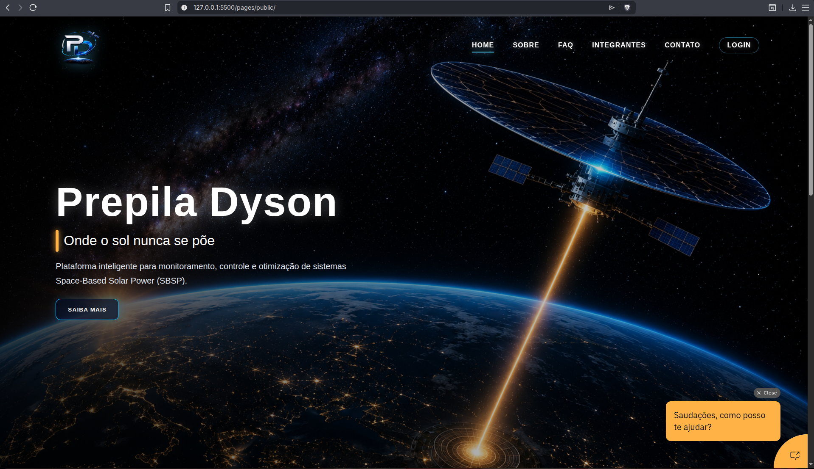
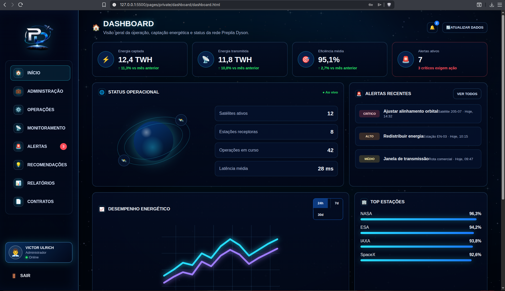
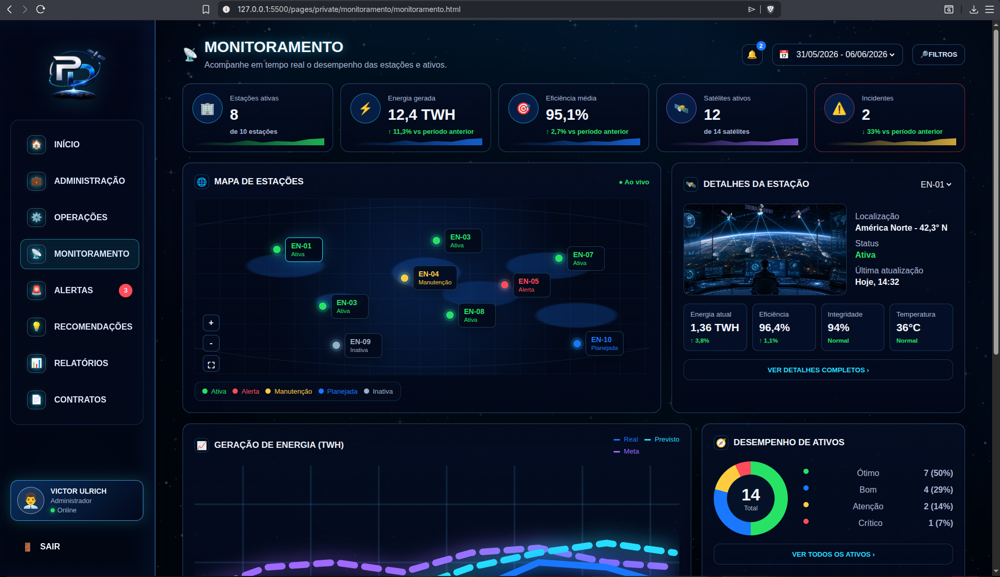
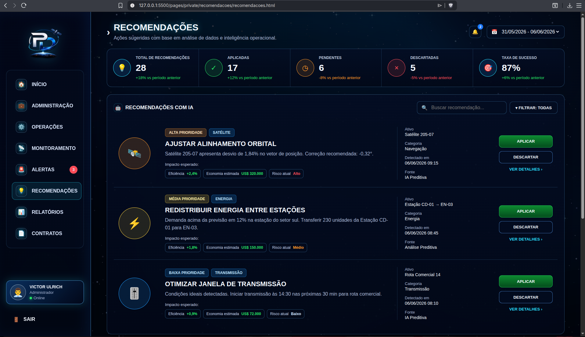
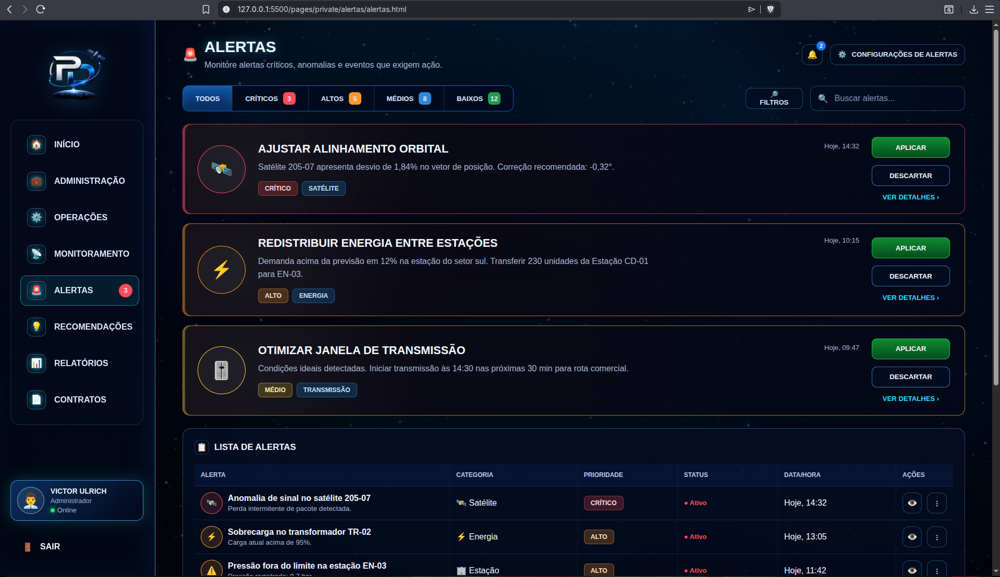

# ⚡ Prepila Dyson — Onde o Sol Nunca se Põe

> Plataforma inteligente desenvolvida como parte da **FIAP Global Solution 2026**, com o objetivo de monitorar, controlar e otimizar ecossistemas de **Space-Based Solar Power (SBSP)** por meio de dashboards, alertas operacionais, relatórios analíticos, gestão de contratos, recomendações inteligentes e suporte via chatbot.

---

## Sumário

- [Visão Geral](#visão-geral)
- [Contexto e Problema](#contexto-e-problema)
- [Solução Proposta](#solução-proposta)
- [Funcionalidades](#funcionalidades)
- [Mecânica Operacional](#mecânica-operacional)
- [Sistema de Monitoramento e Governança](#sistema-de-monitoramento-e-governança)
- [Tecnologias Utilizadas](#tecnologias-utilizadas)
- [Entregas Técnicas Relacionadas](#entregas-técnicas-relacionadas)
- [Estrutura do Projeto](#estrutura-do-projeto)
- [Páginas da Aplicação](#páginas-da-aplicação)
- [Como Executar](#como-executar)
- [Credenciais de Teste](#credenciais-de-teste)
- [Prévia Visual do Projeto](#prévia-visual-do-projeto)
- [Roadmap](#roadmap)
- [Repositório e Vídeo Pitch](#repositório-e-vídeo-pitch)
- [Equipe](#equipe)
- [Contato](#contato)
- [Licença](#licença)

---

## Visão Geral

O **Prepila Dyson** é uma solução web voltada à gestão operacional de sistemas **SBSP (Space-Based Solar Power)**, conceito relacionado à captação de energia solar no espaço e transmissão para estações receptoras na Terra.

A aplicação combina **monitoramento em tempo real**, **controle operacional**, **alertas**, **relatórios**, **gestão de contratos**, **administração de usuários**, **recomendações com apoio de IA** e **chatbot IBM Watson Assistant** para apoiar operadores e gestores na tomada de decisão.

Este repositório contém principalmente a entrega de **Front-End** do projeto Prepila Dyson, desenvolvida com tecnologias web nativas: **HTML5**, **CSS3** e **JavaScript**, incluindo páginas públicas, área privada, autenticação simulada, interface responsiva e componentes interativos.

---

## Contexto e Problema

Com o avanço das pesquisas sobre energia solar espacial, surge a necessidade de plataformas capazes de centralizar dados de satélites, estações receptoras, contratos, alertas e relatórios em um único ambiente de controle.

O desafio é tornar a operação de uma infraestrutura SBSP mais clara, rastreável e eficiente, reduzindo a dispersão de informações e apoiando decisões rápidas em cenários de alta complexidade energética.

**Principais dores endereçadas:**

- Informações operacionais espalhadas entre diferentes sistemas;
- Dificuldade para acompanhar satélites, estações e fluxo energético em tempo real;
- Falta de alertas centralizados para anomalias e riscos operacionais;
- Necessidade de relatórios analíticos para tomada de decisão;
- Controle limitado de contratos, permissões e atividades administrativas;
- Demanda por recomendações inteligentes para otimização energética.

---

## Solução Proposta

O Prepila Dyson resolve esses pontos por meio de uma **plataforma SaaS de inteligência operacional para ecossistemas SBSP**.

Fluxo principal da solução:

1. O usuário acessa a plataforma e realiza login simulado.
2. O dashboard apresenta indicadores estratégicos da operação energética.
3. O operador acompanha satélites, estações receptoras e desempenho da rede.
4. Alertas destacam anomalias, riscos e eventos críticos.
5. Relatórios organizam dados para análise operacional e gerencial.
6. Recomendações inteligentes sugerem ações de otimização energética.
7. Módulos administrativos controlam contratos, perfis, papéis, permissões e atividades.
8. O chatbot auxilia usuários com dúvidas sobre a plataforma e seus recursos.

---

## Funcionalidades

### Para o usuário

- ✅ Login simulado com usuários de teste;
- ✅ Dashboard personalizado com dados do usuário logado;
- ✅ Monitoramento de operações, satélites e estações receptoras;
- ✅ Visualização de alertas operacionais;
- ✅ Gestão de contratos, criação e edição de registros;
- ✅ Relatórios analíticos para apoio à tomada de decisão;
- ✅ Recomendações inteligentes para otimização energética;
- ✅ Área de perfil com dados do usuário;
- ✅ Controle visual de permissões;
- ✅ Administração de papéis, permissões e atividades;
- ✅ FAQ com perguntas frequentes;
- ✅ Formulário de contato;
- ✅ Chatbot integrado com IBM Watson Assistant;
- ✅ Layout responsivo para desktop, tablet e mobile.

### Para apresentação institucional

- 📄 Página inicial com apresentação da solução;
- 📄 Página Sobre com contexto, proposta, tecnologias e roadmap;
- 👥 Página Integrantes com dados da equipe;
- ❓ Página FAQ;
- 📬 Página de Contato;
- 🧩 Páginas privadas demonstrando o funcionamento da plataforma.

---

## Mecânica Operacional

### Monitoramento

O sistema organiza indicadores operacionais para facilitar o acompanhamento de infraestrutura SBSP, incluindo:

- status de satélites e estações receptoras;
- fluxo e desempenho energético;
- eventos operacionais relevantes;
- eficiência da transmissão e recepção;
- acompanhamento de módulos críticos da plataforma.

### Alertas

Os alertas ajudam a identificar ocorrências que exigem atenção da equipe, como:

1. ⚠️ Anomalias operacionais;
2. 🔋 Variações de desempenho energético;
3. 📡 Instabilidades em satélites ou estações;
4. 🛠️ Demandas de manutenção ou verificação;
5. 🔐 Eventos administrativos relevantes.

### Recomendações

As recomendações apoiam decisões estratégicas por meio da análise de dados da operação.

Exemplos:

- otimizar distribuição de energia;
- priorizar verificação de ativos críticos;
- reduzir riscos em períodos de instabilidade;
- apoiar decisões com base em relatórios e indicadores;
- melhorar a continuidade operacional.

### Governança

O projeto também contempla módulos de gestão para organizar a operação:

- 👤 Perfis de usuários;
- 🔐 Papéis e permissões;
- 📄 Contratos;
- 📊 Relatórios;
- 🧾 Histórico de atividades administrativas.

---

## Sistema de Monitoramento e Governança

A plataforma segue uma abordagem integrada para concentrar dados e facilitar decisões operacionais.

| Etapa | Descrição |
|------|-----------|
| **1. Coleta operacional** | Organização de dados simulados relacionados a satélites, estações e energia |
| **2. Monitoramento visual** | Exibição de indicadores, cards, tabelas e estados da operação |
| **3. Alertas** | Destaque de eventos críticos, anomalias e pontos de atenção |
| **4. Relatórios** | Apresentação analítica de dados para apoio gerencial |
| **5. Recomendações** | Sugestões inteligentes para otimização e continuidade operacional |
| **6. Administração** | Controle de contratos, papéis, permissões, usuários e atividades |

> A inteligência artificial é tratada como uma camada de apoio à análise e recomendação, não como substituta da tomada de decisão humana.

---

## Tecnologias Utilizadas

O projeto Prepila Dyson foi desenvolvido de forma multidisciplinar, contemplando entregas de Front-End Design Engineering, Computational Thinking Using Python, Java, Banco de Dados e Chatbot.

| Área / Disciplina | Tecnologia / Ferramenta | Aplicação no Projeto |
|-------------------|--------------------------|----------------------|
| Front-End | **HTML5** | Estruturação semântica das páginas públicas e privadas |
| Front-End | **CSS3** | Estilização, responsividade, animações e layout visual |
| Front-End | **JavaScript Vanilla** | Interatividade, menu responsivo, validação de formulários, login simulado e manipulação de sessão |
| Armazenamento Local | **sessionStorage e localStorage** | Simulação de autenticação e persistência da opção "lembrar usuário" |
| Chatbot | **IBM Watson Assistant** | Criação do chatbot da plataforma, com integração via Webchat |
| Banco de Dados | **Oracle SQL Developer Data Modeler** | Modelagem conceitual e lógica das entidades do sistema |
| Banco de Dados | **Oracle SQL** | Criação dos scripts DDL, tabelas, atributos e constraints |
| Python | **Python 3** | Desenvolvimento de MVP em terminal com menus, validações e funcionalidades simuladas |
| Java | **Java** | Desenvolvimento orientado a objetos com classes, atributos, métodos e execução principal |
| Prototipação | **Figma** | Apoio na criação e visualização das telas do sistema |
| Versionamento | **Git e GitHub** | Controle de versão, colaboração entre integrantes e hospedagem do repositório |

> Este repositório contém principalmente a entrega de **Front-End** do Prepila Dyson. As tecnologias de **Python**, **Java**, **Banco de Dados** e **Chatbot** fazem parte da solução acadêmica completa desenvolvida para a Global Solution.

---

## Entregas Técnicas Relacionadas

### Front-End Design Engineering

A aplicação web foi desenvolvida com **HTML5**, **CSS3** e **JavaScript puro**, contendo páginas públicas e internas, responsividade para desktop, tablet e mobile, login simulado, formulários e interações dinâmicas.

### Computational Thinking Using Python

Foi desenvolvido um MVP em **Python**, com menu de opções contendo funcionalidades principais do sistema. O programa permite ao usuário escolher uma funcionalidade, executar a ação correspondente e retornar ao menu principal.

Foram aplicados conceitos como:

- Estruturas de decisão com `if`;
- Seleção com `match case`;
- Estruturas de repetição com `while` e `for`;
- Listas e tuplas;
- Funções e procedimentos com passagem de parâmetros;
- Validação de entradas do usuário;
- Organização de código e nomenclatura adequada.

### Java

Foi desenvolvido um projeto em **Java** baseado na modelagem do sistema Prepila Dyson, com classes, atributos e métodos alinhados ao diagrama de classes e à proposta da solução.

O projeto Java contempla:

- Classes organizadas em pacotes;
- Atributos representando entidades do sistema;
- Construtores;
- Métodos getters e setters;
- Métodos próprios com funcionalidades da plataforma;
- Classe principal para execução do programa;
- Instanciação de objetos;
- Execução dos métodos implementados;
- Saídas utilizando recursos trabalhados em aula.

### Banco de Dados

A modelagem do banco foi realizada com **Oracle SQL Developer Data Modeler**, contemplando as principais entidades do Prepila Dyson, seus atributos, relacionamentos e regras de negócio.

A entrega inclui:

- Modelo conceitual;
- Modelo lógico relacional;
- Tabelas com chaves primárias e estrangeiras;
- Relacionamentos 1:N e N:N;
- Resolução de relacionamentos N:N com entidades associativas;
- Script DDL em Oracle SQL.

### Chatbot com Watson Assistant

Foi desenvolvido um chatbot utilizando **IBM Watson Assistant**, com foco em auxiliar o usuário no entendimento e uso da plataforma Prepila Dyson.

O chatbot contempla:

- Intenções relacionadas ao projeto;
- Entidades com sinônimos;
- Fluxos de conversa;
- Respostas sobre monitoramento, alertas, relatórios, contratos, recomendações e acesso;
- Integração via Webchat nas páginas públicas.

---

## Estrutura do Projeto

```txt
PrepilaDysonFrontEnd/
├── README.md
│
├── pages/
│   ├── public/
│   │   ├── index.html
│   │   ├── login.html
│   │   ├── sobre.html
│   │   ├── faq.html
│   │   ├── integrantes.html
│   │   └── contato.html
│   │
│   └── private/
│       ├── dashboard/
│       │   └── dashboard.html
│       ├── monitoramento/
│       │   └── monitoramento.html
│       ├── alertas/
│       │   └── alertas.html
│       ├── operacoes/
│       │   └── operacoes.html
│       ├── relatorios/
│       │   └── relatorios.html
│       ├── recomendacoes/
│       │   └── recomendacoes.html
│       ├── contratos/
│       │   ├── contratos.html
│       │   ├── novo-contrato.html
│       │   └── editar-contrato.html
│       ├── administracao/
│       │   ├── administracao.html
│       │   ├── atividades.html
│       │   ├── papeis-permissoes.html
│       │   └── novo-papel.html
│       └── perfil/
│           ├── perfil.html
│           ├── editar-perfil.html
│           └── permissoes.html
│
└── assets/
    ├── css/
    │   ├── index.css
    │   ├── login.css
    │   ├── sobre.css
    │   ├── faq.css
    │   ├── integrantes.css
    │   ├── contato.css
    │   └── estilos por módulo privado
    │
    ├── js/
    │   ├── index.js
    │   ├── login.js
    │   ├── private-session.js
    │   ├── private-data.js
    │   └── scripts por módulo
    │
    └── images/
        ├── avatares/
        ├── backgrounds/
        ├── carrosel/
        ├── icon/
        └── prints/
```

---

## Páginas da Aplicação

### Páginas públicas

- **`pages/public/index.html`** — Página inicial com apresentação do projeto, proposta de valor e chamada para login.
- **`pages/public/login.html`** — Tela de autenticação simulada.
- **`pages/public/sobre.html`** — Contexto do projeto, solução, tecnologias e roadmap.
- **`pages/public/integrantes.html`** — Identificação dos integrantes da equipe.
- **`pages/public/faq.html`** — Perguntas frequentes sobre o Prepila Dyson.
- **`pages/public/contato.html`** — Formulário de contato.

### Páginas internas da solução

- **`pages/private/dashboard/dashboard.html`** — Painel principal com indicadores da plataforma.
- **`pages/private/monitoramento/monitoramento.html`** — Monitoramento de operações, satélites e estações.
- **`pages/private/alertas/alertas.html`** — Acompanhamento de alertas operacionais.
- **`pages/private/operacoes/operacoes.html`** — Gestão e acompanhamento de operações.
- **`pages/private/relatorios/relatorios.html`** — Relatórios analíticos.
- **`pages/private/recomendacoes/recomendacoes.html`** — Recomendações inteligentes.
- **`pages/private/contratos/contratos.html`** — Listagem e gestão de contratos.
- **`pages/private/contratos/novo-contrato.html`** — Cadastro de novo contrato.
- **`pages/private/contratos/editar-contrato.html`** — Edição de contrato existente.
- **`pages/private/administracao/administracao.html`** — Área administrativa.
- **`pages/private/administracao/atividades.html`** — Histórico de atividades.
- **`pages/private/administracao/papeis-permissoes.html`** — Controle de papéis e permissões.
- **`pages/private/administracao/novo-papel.html`** — Cadastro de novo papel.
- **`pages/private/perfil/perfil.html`** — Perfil do usuário logado.
- **`pages/private/perfil/editar-perfil.html`** — Edição de perfil.
- **`pages/private/perfil/permissoes.html`** — Visualização de permissões do usuário.

---

## Como Executar

O projeto é estático e não requer instalação de dependências.

### Opção 1 — Abrir diretamente no navegador

1. Clone o repositório:

```bash
git clone https://github.com/Dev-Ulrich/PrepilaDysonFrontEnd.git
```

2. Entre na pasta do projeto:

```bash
cd PrepilaDysonFrontEnd
```

3. Abra o arquivo `pages/public/index.html` em um navegador moderno.

### Opção 2 — Usar servidor local

Também é possível executar com um servidor local simples:

```bash
python -m http.server 8000
```

Depois acesse:

```txt
http://localhost:8000/pages/public/index.html
```

Também é possível utilizar a extensão **Live Server** no Visual Studio Code.

---

## Credenciais de Teste

A autenticação é simulada e armazenada via `sessionStorage`. Ao marcar a opção de lembrar usuário, os dados também são persistidos em `localStorage`.

| Usuário | Senha | Perfil |
|--------|-------|--------|
| `admPrepilaDyson` | `PrepilaDyson2026` | Administrador |
| `Matheus Pereira` | `569315` | Operador |
| `Victor Ulrich` | `568634` | Administrador |
| `Matheus Luca` | `572228` | Analista |
| `Arthur da Silva` | `571075` | Técnico |
| `Yasmin Capi` | `571926` | Gestora |
| `Alexandre Carlos` | `271280` | Supervisor |

> Após o login, o usuário é redirecionado para `pages/private/dashboard/dashboard.html`. O logout limpa a sessão simulada e retorna para a tela de login.

---

## Prévia Visual do Projeto

As imagens abaixo representam algumas das principais telas e recursos desenvolvidos no projeto.

### Página Inicial



### Dashboard



### Monitoramento



### Recomendações



### Alertas Operacionais



---

## Roadmap

### Concluído nesta entrega

- [x] Definição do problema e da proposta de solução;
- [x] Criação da identidade visual do Prepila Dyson;
- [x] Desenvolvimento da página inicial;
- [x] Desenvolvimento da página Integrantes;
- [x] Desenvolvimento da página Sobre;
- [x] Desenvolvimento da página FAQ;
- [x] Desenvolvimento da página Contato;
- [x] Desenvolvimento das páginas internas da solução;
- [x] Implementação de login simulado;
- [x] Implementação de dashboard personalizado;
- [x] Implementação dos módulos de monitoramento, operações e alertas;
- [x] Implementação dos módulos de relatórios e recomendações;
- [x] Implementação da gestão de contratos;
- [x] Implementação de perfil, permissões e administração;
- [x] Implementação de menu responsivo;
- [x] Implementação de interações com JavaScript;
- [x] Implementação de validação de formulário;
- [x] Integração do Webchat IBM Watson Assistant;
- [x] Organização dos arquivos em pastas separadas para HTML, CSS, JavaScript e imagens;
- [x] Versionamento do projeto com Git e GitHub.

### Entregas relacionadas à Global Solution

- [x] Modelagem do banco de dados com Oracle SQL Developer Data Modeler;
- [x] Criação de scripts DDL em Oracle SQL;
- [x] Desenvolvimento de MVP em Python com menu de opções e validações;
- [x] Desenvolvimento de projeto Java orientado a objetos;
- [x] Criação de chatbot no IBM Watson Assistant.

### Melhorias futuras

- [ ] Integração real com back-end;
- [ ] Persistência real em banco de dados;
- [ ] Autenticação real de usuários;
- [ ] Consumo de dados reais de satélites e estações receptoras;
- [ ] Integração com APIs externas de energia e operação;
- [ ] Sistema real de notificações para alertas críticos;
- [ ] Recomendação com modelos de IA conectados a dados operacionais;
- [ ] Painel administrativo com auditoria completa.

---

## Repositório e Vídeo Pitch

Link público do projeto no GitHub:

```txt
https://github.com/Dev-Ulrich/PrepilaDysonFrontEnd
```

O link público do vídeo pitch será adicionado após a publicação.

---

## Equipe

Projeto desenvolvido pela equipe **Prepila Dyson**, da turma **1TDSPW** da **FIAP**.

| Integrante | RM | Turma | GitHub | LinkedIn |
|-----------|----|-------|--------|----------|
| Victor Ulrich Costa Alves da Silva | 568634 | 1TDSPW | [https://github.com/Dev-Ulrich](https://github.com/Dev-Ulrich) | [https://www.linkedin.com/in/victorulrichcosta/](https://www.linkedin.com/in/victorulrichcosta/) |
| Matheus Pereira da Silva Franco | 569315 | 1TDSPW | [https://github.com/MatheusPSFranco](https://github.com/MatheusPSFranco) | [https://www.linkedin.com/in/matheus-pereira-da-silva-franco-b7a7b03b7/](https://www.linkedin.com/in/matheus-pereira-da-silva-franco-b7a7b03b7/) |
| Matheus Luca Fouad Barragão | 572228 | 1TDSPW | [https://github.com/MatheusLuca](https://github.com/MatheusLuca) | [https://www.linkedin.com/in/matheusbarragao/](https://www.linkedin.com/in/matheusbarragao/) |
| Arthur da Silva Santana | 571075 | 1TDSPW | [https://github.com/arthursantana1521](https://github.com/arthursantana1521) | [https://www.linkedin.com/in/arthur-da-silva-santana-a6061a310](https://www.linkedin.com/in/arthur-da-silva-santana-a6061a310) |
| Yasmin Capi | 571926 | 1TDSPW | [https://github.com/yasmincappi](https://github.com/yasmincappi) | [https://www.linkedin.com/in/yasmincappi/](https://www.linkedin.com/in/yasmincappi/) |

---

## Contato

Em caso de dúvidas sobre o projeto, entre em contato com a equipe Prepila Dyson.

**Responsável para contato:**

- **Nome:** Victor Ulrich Costa Alves da Silva
- **E-mail:** [victorulrich07@gmail.com](mailto:victorulrich07@gmail.com)
- **GitHub:** [https://github.com/Dev-Ulrich](https://github.com/Dev-Ulrich)

---

## Licença

Projeto acadêmico desenvolvido para fins educacionais como parte da **FIAP Global Solution 2026**.

O uso, redistribuição e adaptação deste projeto devem respeitar as diretrizes da FIAP, da proposta da Global Solution e dos integrantes da equipe.

---

<p align="center">
  <strong>Prepila Dyson</strong> — Onde o Sol Nunca se Põe.<br/>
  © 2026 Prepila Dyson — FIAP Global Solution
</p>
